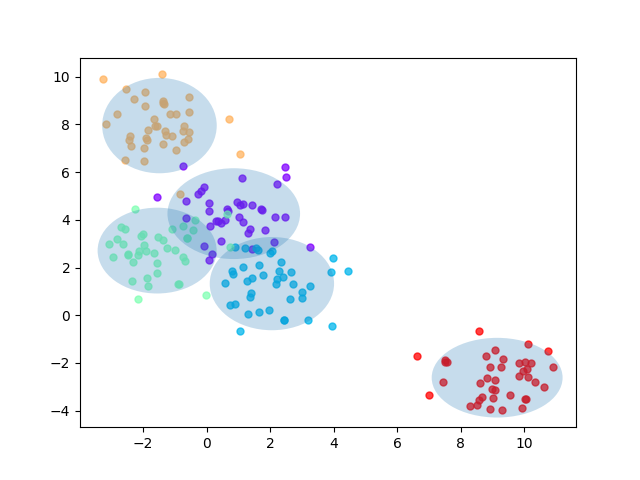
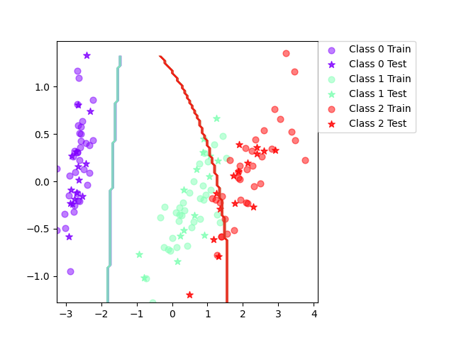
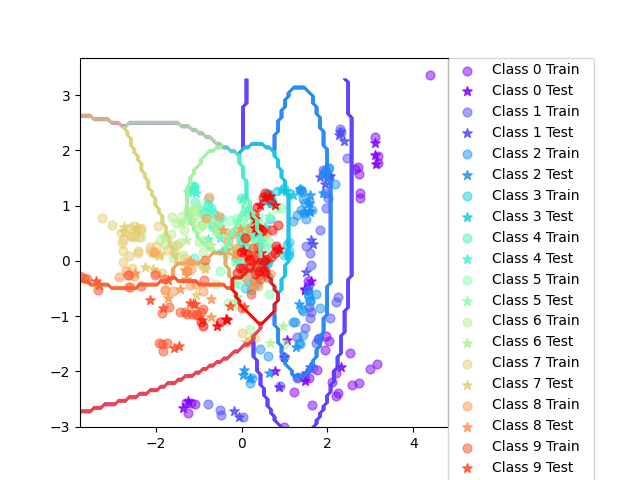
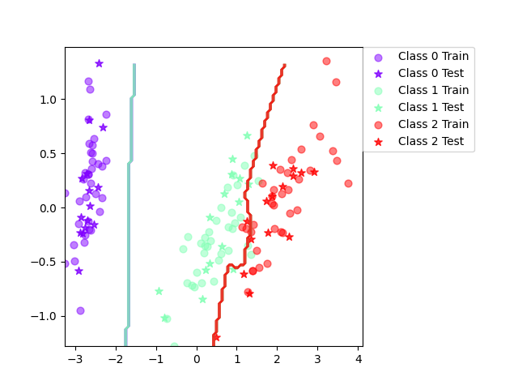
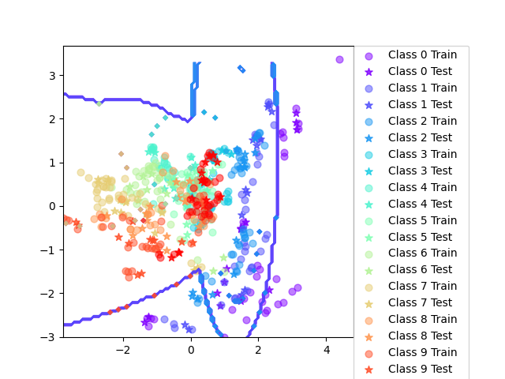
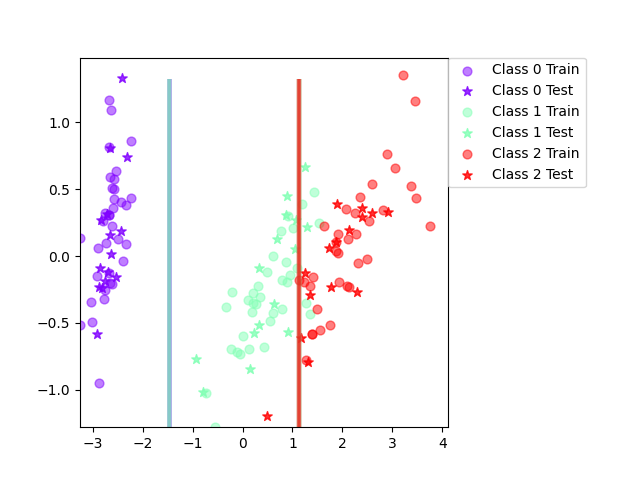
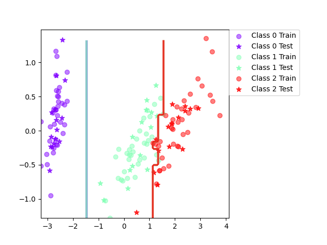
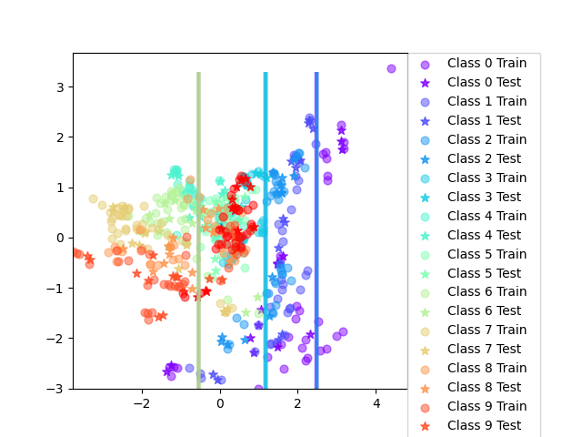
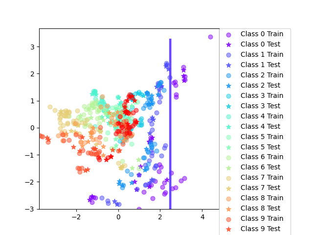

# Bayesian Learning and Boosting

Authors: Dominik Łasiński and David Glaas

## Assignment 3

Iris Results:
Final mean classification accuracy  89 with standard deviation 4.16

Vowel Results:
Final mean classification accuracy  64.7 with standard deviation 4.03

### When can a feature independence assumption be reasonable and when not?

If from the start it is known that the features do not have major dependecies between the features, then an assumption of features being independent can help reducing the complexity of the model. However, in some more complex tasks, like NLP, the model might not be able to grasp the independecy of the words, thus the assumption of features independence may not be as good of an option.

### How does the decision boundary look for the Iris dataset? How could one improve the classification results for this scenario by changing classifier or, alternatively, manipulating the data?

The decision boundaries are overlapping, and that is becasue the dependencies of the data points are visible in the plots, thus it might be a good idea to manipulate the data to decrease the dependencies, thus creating smaller overlapps for the decision boundaries.

## Assignment 5

Iris boosting results:
Final mean classification accuracy  94.1 with standard deviation 6.72

Vowel boosting results:
Final mean classification accuracy  80.2 with standard deviation 3.52

### Is there any improvement in classification accuracy? Why/why not?

For iris: 94.1 > 89

For vowel: 80.2 > 64.7

Yes there is an accuracy improvement. In increased because a more complex model was used to classify the data. This is due to the weight being adapated in order to represent their importance for their classifications.

### Plot the decision boundary of the boosted classifier on iris and compare it with that of the basic. What differences do you notice? Is the boundary of the boosted version more complex?

It has more complex boundaries, because the boosting algorithm makes the model more focus on the misclassified samples. But it is also going towards the visible-correct side (from left to right).

### Can we make up for not using a more advanced model in the basic classifier (e.g. independent features) by using boosting?

Yes, using boosting could indeed make up for not using a more advanced model. But it would be better if we could try several weak classifier and choose the best one in order to decrease computing waste.

## Assignment 6
Iris: Final mean classification accuracy  92.4 with standard deviation 3.71

Iris with boosting: Final mean classification accuracy  94.6 with standard deviation 3.65

Vowel: Final mean classification accuracy  64.1 with standard deviation 4

Vowel with boosting: Final mean classification accuracy  86.6 with standard deviation 2.92

### Is there any improvement in classification accuracy? Why/why not?

Iris: 94.6 > 92.4
Vowel: 86.6 > 64.1

Boosting increased the accuracy of the sklearn DecisionTreeClassifier() model in both datasets.

### Plot the decision boundary of the boosted classifier on iris and compare it with that of the basic. What differences do you notice? Is the boundary of the boosted version more complex?

The decision boundary becomes more complex (due to the complexity of the data). The key difference is that in a non-boosted model, the line seems to be straight, but in boosted model, the line is leaning towards the right side, creating a more accurate boundary between the classes.

### Can we make up for not using a more advanced model in the basic classifier (e.g. independent features) by using boosting?

Yes, using boosting could indeed make up for not using a more advanced model. But it would be better if we could try several weak classifier and choose the best one in order to decrease computing waste.

## Assignment 7

### If you had to pick a classifier, naive Bayes or a decision tree or the boosted versions of these, which one would you pick?

- Outliers:
Naive Bayes. Since Decision Tree will overfit the data and be misguided by the outliers and the boosting model will also focus more on the outliers.

- Irrelevant inputs: part of the feature space is irrelevant
Decision Tree with boosting. Since Decision Tree models will automatically ignore those irrelevant features and in the meanwhile boosting could improve the performance of the final prediction.

- Predictive power
Decision Tree with boosting. Since the accuracy is higher compared to the other models.

- Mixed types of data: binary, categorical or continuous features, etc.
Decision Tree with boosting. Since Decision Trees are more flexible while Naive Bayes can only work well on continuous data.

- Scalability: the dimension of the data, D, is large or the number of instances, N, is large, or both.
Decision Tree without boosting. Decision trees perform well when the dataset is large while Naive Bayes cannot. Boosting algorithms require large computing ability.

